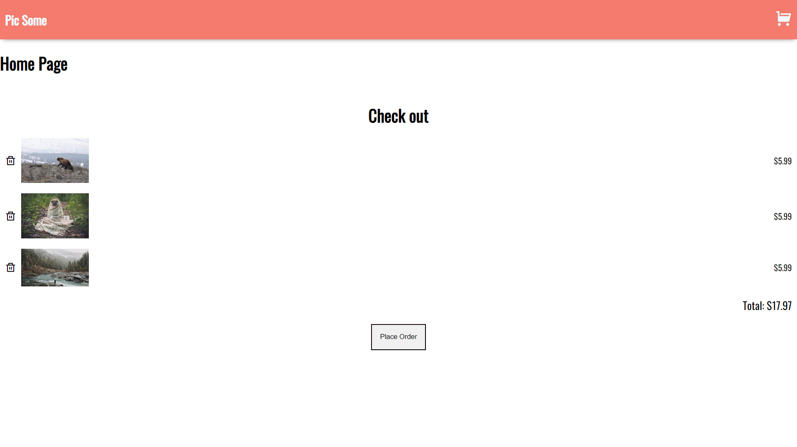

## Pic Some

Quick start:

```
$ npm install
$ npm dev
$ npm build
```

## Image attributions:
https://picsum.photos/

https://unsplash.com/

## GitHub repo of images and JSON file
https://github.com/bobziroll/scrimba-react-bootcamp-images

## Icon library
https://remixicon.com/

## Libraries
* React Router - https://reacttraining.com/react-router/web/guides/quick-start
* PropTypes - https://reactjs.org/docs/typechecking-with-proptypes.html




<p align="center">
  
</p>
<p align="center">
  
</p>
